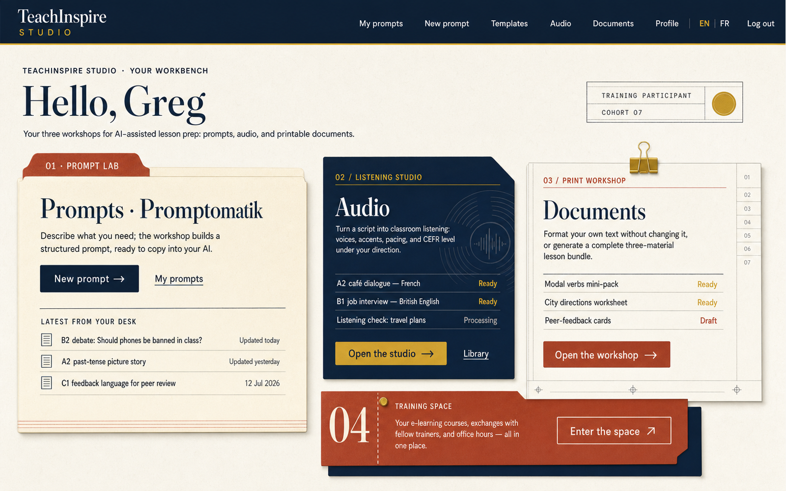
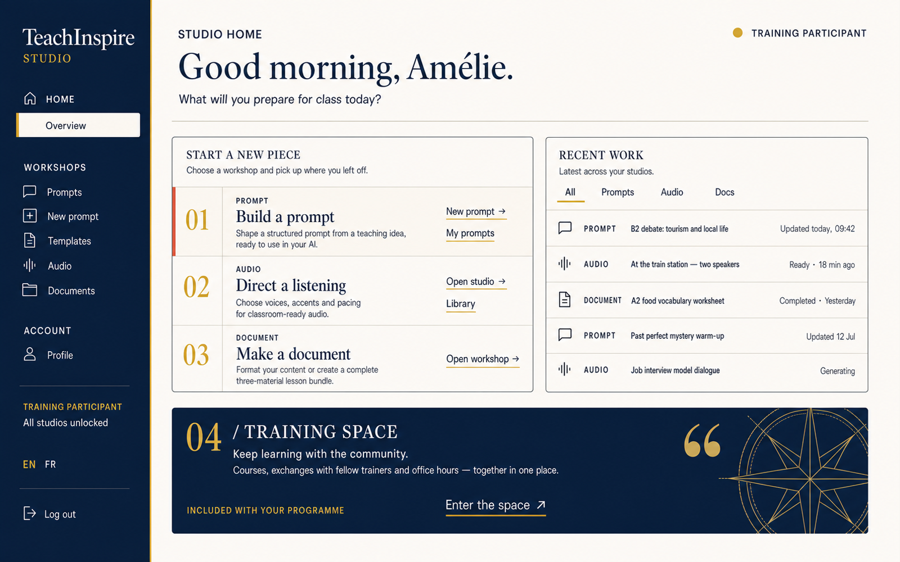
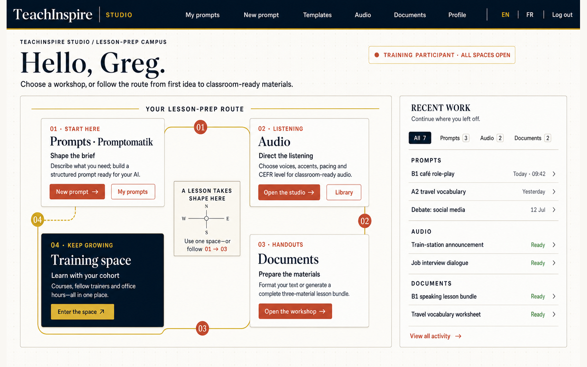

# TeachInspire Studio home redesign concepts

Generated with the built-in Imagegen workflow at 1600 x 1000. All three concepts preserve the participant-state jobs from `src/pages/home.tsx`: Prompts, Audio, Documents, Training Space, and recent work.

## 1. The Marking Desk

An editorial teacher's workbench. A dominant prompt folio, a navy audio sleeve, a typesetter's document proof, and a pinned training notice use the existing Fraunces/DM Sans typography and navy/cream/gold/terracotta palette.

Build shape: top navigation, editorial masthead, asymmetric `720px 344px 344px` workspace grid, thin rules, clipped decorative corners, restrained paper texture. Interactive content remains axis-aligned.

Final prompt: create a straight-on, high-fidelity, buildable desktop UI mockup for TeachInspire Studio called "The Marking Desk". Use a 1600 x 1000 warm cream canvas, a 76px navy navigation bar with a gold baseline, an editorial masthead saying "Hello, Greg", a large cream tabbed folio for "Prompts · Promptomatik", a navy record-sleeve panel for "Audio", a ruled proof-sheet panel for "Documents", and a terracotta syllabus strip for "Training Space". Show realistic recent prompt, audio, and document rows plus practical primary and secondary actions. Use Fraunces-style display serif and DM Sans-style interface text with colors #132038, #F9F7F3, #CCAA30, and #BF4E36. Preserve the participant/open state. Keep it reproducible in React and CSS. Avoid a photoreal desk, 3D perspective, floating generic cards, gradients, glassmorphism, purple, fake analytics, decorative clutter, and watermarks.

## 2. The Lesson Production Desk

A focused creative console optimized around two questions: what should I start, and where did I stop? A permanent tool rail, unified three-lane start panel, chronological recent-work ledger, and substantial Training Space banner create a calmer, more professional operating surface.

Build shape: `248px` navy rail plus main workspace; unified bordered lanes instead of cards; `820px` start console beside a `412px` ledger; full-width navy training panel.

Final prompt: create a pixel-precise, front-facing 1600 x 1000 desktop home console for TeachInspire Studio. Use a 248px deep navy left rail with "TeachInspire / STUDIO", sectioned navigation, participant status, language, and logout. On a warm cream main canvas, place a header saying "Good morning, Amélie" and "What will you prepare for class today?" Below it place one unified white production panel titled "START A NEW PIECE" with three ruled horizontal lanes: "01 PROMPT / Build a prompt", "02 AUDIO / Direct a listening", and "03 DOCUMENT / Make a document", each with concise descriptions and practical actions. Beside it place a fine-rule "RECENT WORK" ledger with five cross-module rows. Add a full-width navy "04 / TRAINING SPACE" panel at the bottom. Use Fraunces-style headings, DM Sans-style UI text, #132038 navy, #F9F7F3 cream, #CCAA30 gold, and #BF4E36 terracotta. Use 4px radii, hairline rules, minimal shadow, and accessible spacing. Avoid floating card grids, charts, avatars, photography, 3D, gradients, glassmorphism, purple, clutter, and watermarks.

## 3. The Lesson-Prep Quadrangle

A spatial but still practical campus map. Four workshop pavilions sit around a central courtyard and a simple gold route makes the lesson-prep journey visible without forcing a linear workflow.

Build shape: top navigation, `1008px` CSS-grid campus beside a `436px` recent-work rail; four rectangular workshop sections connected by one decorative SVG path; route disappears and panels stack on mobile.

Final prompt: create a polished, shippable 1600 x 1000 desktop UI redesign for TeachInspire Studio called "The Lesson-Prep Quadrangle". Use a warm cream background with an extremely subtle editorial registration grid and a 76px navy top navigation with a gold baseline. Place a 1008px campus panel on the left and a 436px Recent Work rail on the right. Inside the campus arrange four flat rectangular pavilions around a small central courtyard: "01 · START HERE / Prompts · Promptomatik", "02 · LISTENING / Audio", "03 · HANDOUTS / Documents", and a dark navy "04 · KEEP GROWING / Training space". Connect them with a thin gold route and terracotta numbered nodes. The header says "Hello, Greg" and "Choose a workshop, or follow the route from first idea to classroom-ready materials." Use Fraunces-style headings, DM Sans-style interface copy, and #132038, #FDFCF9, #F4F1EB, #BF4E36, #CCAA30. Make every panel and route reproducible with CSS Grid and one simple SVG. Avoid literal buildings, people, landscape illustration, isometric perspective, 3D, glassmorphism, excessive rounding, gradients, decorative clutter, and watermarks.

## Shared implementation rules

- Keep Audio and Documents visible in the free state, but add a `TRAINING` lock treatment and replace actions with `Discover the training`.
- Keep controls at least 44px high and retain visible gold focus rings.
- Preserve the existing Fraunces Variable and DM Sans Variable fonts and brand tokens.
- Use one purposeful entrance motion per direction and respect `prefers-reduced-motion`.
