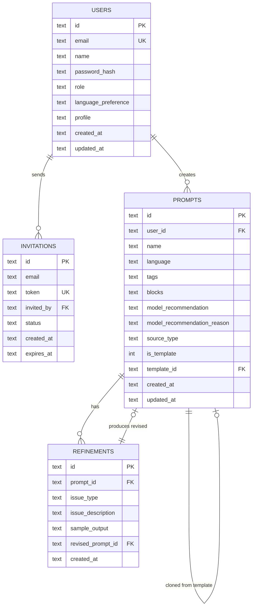

# Project Foundation Setup

React + Vite on Cloudflare Workers, D1 database schema, KV sessions, TeachInspire design system, and ReactBits component library.

## Overview

Set up the complete Promptomatik project foundation: a React 19 + Vite 6 SPA deployed on Cloudflare Workers (via the Cloudflare Vite Plugin), with Hono API routing, D1 database schema for all v1 tables, KV-based session management, and a design system built on the TeachInspire brand kit (Fraunces + DM Sans, navy/cream/terracotta/gold, sharp rectangular buttons) with ReactBits for animation components.

**Critical architecture note:** Cloudflare now recommends **Workers + Vite Plugin** over the legacy Pages Functions approach. This means:
- API routes live in `worker/index.ts` (single entry point with Hono router) — **not** in a `/functions/` directory
- We deploy with `wrangler deploy`, not `wrangler pages deploy`
- The `@cloudflare/vite-plugin` runs the Worker in the native `workerd` runtime during local dev
- Static assets (the React SPA) are served via Workers `assets` configuration

This replaces the `/functions/` convention mentioned in `CLAUDE.md` and should be updated there.

---

## Technical Approach

### Architecture

```
promptomatik/
  index.html                         # SPA entry point
  vite.config.ts                     # Vite + Cloudflare plugin
  wrangler.jsonc                     # Worker config, D1/KV bindings
  tsconfig.json                      # Root (references only)
  tsconfig.app.json                  # React SPA (src/)
  tsconfig.node.json                 # Vite config, build scripts
  tsconfig.worker.json               # Worker code (worker/)
  package.json
  .dev.vars                          # Local secrets (gitignored)
  .env.example                       # Template for .dev.vars

  worker/
    index.ts                         # Hono app, API route registration
    env.ts                           # Env interface (D1, KV, secrets)
    routes/
      auth.ts                        # POST /api/auth/login, /register, /logout
      health.ts                      # GET /api/health
    lib/
      session.ts                     # KV session CRUD + cookie helpers
      password.ts                    # bcryptjs hash + verify

  src/
    main.tsx                         # React entry + font imports
    App.tsx                          # Router setup
    pages/                           # Route components
    components/
      ui/                            # Design system primitives (Button, Input, Card, etc.)
      layout/                        # Shell, Nav, Footer
    lib/
      i18n/
        fr.json                      # French translations
        en.json                      # English translations
        index.ts                     # i18n helper
      api.ts                         # Fetch wrapper for /api/* calls
    styles/
      tokens.css                     # Design tokens (colors, fonts, spacing)
      global.css                     # Global styles, font-face, resets
    reactbits/                       # Copied ReactBits components

  migrations/
    0001_init-schema.sql             # Users, invitations, prompts, refinements

  seed/
    seed-admin.sql                   # Bootstrap admin user for development
```

### Key Technology Choices

| Choice | Technology | Rationale |
|--------|-----------|-----------|
| Frontend | React 19 + Vite 6 | User request. Rich ecosystem for block editor (Phase 3) |
| Backend | Hono on Workers | Lightweight, typed, perfect for Cloudflare Workers. Replaces file-based Pages Functions |
| Database | Cloudflare D1 | SQLite at edge. JSON1 extension for profile/tags/blocks columns |
| Sessions | Cloudflare KV | Low-latency reads, TTL expiration, simple key-value model |
| Fonts | @fontsource-variable | Self-hosted, no Google Fonts CDN. Eliminates third-party DNS + privacy concern |
| Animations | ReactBits (copy-paste) | Visual flair components. NOT form primitives — we build those ourselves |
| CSS | CSS custom properties + minimal Tailwind-free approach | Clean, maintainable. Teachers see a polished app, not a utility-class soup |
| Password hashing | bcryptjs | Pure JS, works in Workers runtime. 10 rounds (Workers CPU limit safe) |
| Routing (client) | React Router v7 | Standard SPA routing, no SSR needed |
| Icons | Lucide React | Clean, consistent, tree-shakeable |

---

## Implementation Phases

### Phase 1: Scaffold & Config (the skeleton)

**Goal:** `npm run dev` works, serves a React SPA with Cloudflare Workers backend, D1 and KV bindings accessible.

#### 1.1 Initialize project

```bash
npm create cloudflare@latest -- promptomatik --framework=react --platform=workers
```

If the C3 scaffold doesn't match our needs, fall back to manual setup:

```bash
npm create vite@latest -- . --template react-ts
npm install -D @cloudflare/vite-plugin wrangler @cloudflare/workers-types
```

**Install core dependencies:**

```bash
# Frontend
npm install react-router lucide-react
npm install @fontsource-variable/fraunces @fontsource-variable/dm-sans

# Worker
npm install hono bcryptjs
npm install -D @types/bcryptjs
```

#### 1.2 Configure Vite + Cloudflare

**`vite.config.ts`**

```typescript
import { defineConfig } from "vite";
import react from "@vitejs/plugin-react";
import { cloudflare } from "@cloudflare/vite-plugin";

export default defineConfig({
  plugins: [react(), cloudflare()],
  resolve: {
    alias: {
      "@": "/src",
    },
  },
});
```

#### 1.3 Configure Wrangler

**`wrangler.jsonc`**

```jsonc
{
  "$schema": "node_modules/wrangler/config-schema.json",
  "name": "promptomatik",
  "main": "./worker/index.ts",
  "compatibility_date": "2026-02-10",
  "compatibility_flags": ["nodejs_compat"],
  "assets": {
    "not_found_handling": "single-page-application",
    "run_worker_first": ["/api/*"]
  },
  "d1_databases": [
    {
      "binding": "DB",
      "database_name": "promptomatik-db",
      "database_id": "<TO_BE_CREATED>"
    }
  ],
  "kv_namespaces": [
    {
      "binding": "SESSIONS",
      "id": "<TO_BE_CREATED>",
      "preview_id": "<TO_BE_CREATED>"
    }
  ]
}
```

Key settings:
- `not_found_handling: "single-page-application"` — serves `index.html` for all non-file, non-API routes (React Router works)
- `run_worker_first: ["/api/*"]` — API requests hit the Worker before SPA fallback
- `nodejs_compat` — enables Node.js APIs in Workers (needed for some npm packages)

**Important:** Do NOT create a `404.html` in the build output — it would override SPA fallback.

#### 1.4 Configure TypeScript

**`tsconfig.json`** (root — references only)

```json
{
  "files": [],
  "references": [
    { "path": "./tsconfig.app.json" },
    { "path": "./tsconfig.node.json" },
    { "path": "./tsconfig.worker.json" }
  ]
}
```

**`tsconfig.app.json`** (React SPA code in `/src`)

```json
{
  "compilerOptions": {
    "target": "ES2020",
    "useDefineForClassFields": true,
    "lib": ["ES2020", "DOM", "DOM.Iterable"],
    "module": "ESNext",
    "skipLibCheck": true,
    "moduleResolution": "bundler",
    "allowImportingTsExtensions": true,
    "isolatedModules": true,
    "moduleDetection": "force",
    "noEmit": true,
    "jsx": "react-jsx",
    "strict": true,
    "noUnusedLocals": true,
    "noUnusedParameters": true,
    "noFallthroughCasesInSwitch": true,
    "forceConsistentCasingInFileNames": true,
    "baseUrl": ".",
    "paths": {
      "@/*": ["./src/*"]
    }
  },
  "include": ["src"]
}
```

**`tsconfig.worker.json`** (Worker code in `/worker`)

```json
{
  "extends": "./tsconfig.node.json",
  "compilerOptions": {
    "tsBuildInfoFile": "./node_modules/.tmp/tsconfig.worker.tsbuildinfo",
    "types": ["@cloudflare/workers-types/2023-07-01", "vite/client"]
  },
  "include": ["worker"]
}
```

#### 1.5 Create Cloudflare resources

```bash
# Create D1 database
npx wrangler d1 create promptomatik-db
# → Paste the database_id into wrangler.jsonc

# Create KV namespace
npx wrangler kv namespace create SESSIONS
# → Paste the id into wrangler.jsonc

# Create preview KV namespace
npx wrangler kv namespace create SESSIONS --preview
# → Paste the preview_id into wrangler.jsonc
```

#### 1.6 Create `.dev.vars` for local secrets

```
OPENROUTER_API_KEY=sk-or-placeholder
RESEND_API_KEY=re_placeholder
APP_SECRET=dev-secret-change-in-production
```

Add `.dev.vars` to `.gitignore`.

#### 1.7 Verify: `npm run dev` serves the React app, `/api/health` returns JSON

---

### Phase 2: D1 Database Schema

**Goal:** All v1 tables created with proper constraints, indexes, and JSON column handling.

#### 2.1 Initial migration

**`migrations/0001_init-schema.sql`**

```sql
-- Enable foreign keys (D1 requires this per-connection in Workers)
-- Note: PRAGMA foreign_keys = ON must be set in application code per request

-- ============================================================
-- Users
-- ============================================================
CREATE TABLE IF NOT EXISTS users (
  id TEXT PRIMARY KEY,                                          -- crypto.randomUUID()
  email TEXT UNIQUE NOT NULL,
  name TEXT NOT NULL,
  password_hash TEXT NOT NULL,
  role TEXT NOT NULL DEFAULT 'teacher'
    CHECK (role IN ('teacher', 'admin')),
  language_preference TEXT NOT NULL DEFAULT 'fr'
    CHECK (language_preference IN ('fr', 'en')),
  profile TEXT NOT NULL DEFAULT '{}',                           -- JSON: languages_taught, typical_levels, etc.
  created_at TEXT NOT NULL DEFAULT (datetime('now')),
  updated_at TEXT NOT NULL DEFAULT (datetime('now'))
);

CREATE INDEX idx_users_email ON users(email);

-- ============================================================
-- Invitations
-- ============================================================
CREATE TABLE IF NOT EXISTS invitations (
  id TEXT PRIMARY KEY,
  email TEXT NOT NULL,
  token TEXT UNIQUE NOT NULL,
  invited_by TEXT NOT NULL,
  status TEXT NOT NULL DEFAULT 'pending'
    CHECK (status IN ('pending', 'accepted', 'expired')),
  created_at TEXT NOT NULL DEFAULT (datetime('now')),
  expires_at TEXT NOT NULL,
  FOREIGN KEY (invited_by) REFERENCES users(id) ON DELETE CASCADE
);

CREATE INDEX idx_invitations_token ON invitations(token);
CREATE INDEX idx_invitations_email ON invitations(email);
CREATE INDEX idx_invitations_status ON invitations(status);

-- ============================================================
-- Prompts
-- ============================================================
CREATE TABLE IF NOT EXISTS prompts (
  id TEXT PRIMARY KEY,
  user_id TEXT NOT NULL,
  name TEXT NOT NULL DEFAULT '',
  language TEXT NOT NULL DEFAULT 'fr'
    CHECK (language IN ('fr', 'en')),
  tags TEXT NOT NULL DEFAULT '[]',                              -- JSON array of strings
  blocks TEXT NOT NULL DEFAULT '[]',                            -- JSON array of technique blocks
  model_recommendation TEXT,
  model_recommendation_reason TEXT,
  source_type TEXT NOT NULL DEFAULT 'from_scratch'
    CHECK (source_type IN ('from_scratch', 'from_source')),
  is_template INTEGER NOT NULL DEFAULT 0,                       -- SQLite boolean: 0/1
  template_id TEXT,
  created_at TEXT NOT NULL DEFAULT (datetime('now')),
  updated_at TEXT NOT NULL DEFAULT (datetime('now')),
  FOREIGN KEY (user_id) REFERENCES users(id) ON DELETE CASCADE,
  FOREIGN KEY (template_id) REFERENCES prompts(id) ON DELETE SET NULL
);

CREATE INDEX idx_prompts_user_id ON prompts(user_id);
CREATE INDEX idx_prompts_is_template ON prompts(is_template);
CREATE INDEX idx_prompts_user_updated ON prompts(user_id, updated_at);

-- ============================================================
-- Refinements
-- ============================================================
CREATE TABLE IF NOT EXISTS refinements (
  id TEXT PRIMARY KEY,
  prompt_id TEXT NOT NULL,
  issue_type TEXT NOT NULL
    CHECK (issue_type IN ('too_hard', 'too_long', 'too_generic', 'off_topic', 'wrong_level', 'other')),
  issue_description TEXT,
  sample_output TEXT,
  revised_prompt_id TEXT,
  created_at TEXT NOT NULL DEFAULT (datetime('now')),
  FOREIGN KEY (prompt_id) REFERENCES prompts(id) ON DELETE CASCADE,
  FOREIGN KEY (revised_prompt_id) REFERENCES prompts(id) ON DELETE SET NULL
);

CREATE INDEX idx_refinements_prompt_id ON refinements(prompt_id);
```

**Schema decisions:**
- `ON DELETE CASCADE` on user_id FK — deleting a user removes their prompts and refinements
- `ON DELETE SET NULL` on template_id — deleting a template doesn't destroy prompts made from it
- `TEXT` for all IDs — `crypto.randomUUID()` in application code
- `INTEGER` for booleans (SQLite has no BOOLEAN type)
- `CHECK` constraints for enums (SQLite has no ENUM type)
- `TEXT` with JSON for arrays/objects — queryable via JSON1 extension
- Compound index `(user_id, updated_at)` for "My Prompts" sorted by recent

#### 2.2 Apply migration

```bash
# Local
npx wrangler d1 execute promptomatik-db --local --file=./migrations/0001_init-schema.sql

# Production (when ready)
npx wrangler d1 execute promptomatik-db --remote --file=./migrations/0001_init-schema.sql
```

#### 2.3 Seed script for development

**`seed/seed-admin.sql`**

```sql
-- Seed admin user (password: "admin123" — dev only, hashed with bcryptjs 10 rounds)
-- The actual hash must be generated at seed time via a script
INSERT OR IGNORE INTO users (id, email, name, password_hash, role, language_preference, profile)
VALUES (
  '00000000-0000-0000-0000-000000000001',
  'greg@teachinspire.com',
  'Greg',
  '$2a$10$PLACEHOLDER_HASH_GENERATED_BY_SEED_SCRIPT',
  'admin',
  'fr',
  '{}'
);
```

A proper seed script (`seed/seed.ts`) should hash the password with bcryptjs and execute the SQL.

#### 2.4 Worker env types

**`worker/env.ts`**

```typescript
export interface Env {
  DB: D1Database;
  SESSIONS: KVNamespace;
  OPENROUTER_API_KEY: string;
  RESEND_API_KEY: string;
  APP_SECRET: string;
}
```

---

### Phase 3: KV Session Management

**Goal:** Login creates a session in KV, subsequent requests authenticate via session cookie.

#### 3.1 Session module

**`worker/lib/session.ts`**

```typescript
import type { Env } from "../env";

export interface SessionData {
  userId: string;
  email: string;
  role: "teacher" | "admin";
  languagePreference: "fr" | "en";
  createdAt: number;
}

const SESSION_TTL = 60 * 60 * 24 * 7; // 7 days
const COOKIE_NAME = "promptomatik_session";

export async function createSession(env: Env, data: SessionData): Promise<string> {
  const sessionId = crypto.randomUUID();
  await env.SESSIONS.put(
    `session:${sessionId}`,
    JSON.stringify(data),
    { expirationTtl: SESSION_TTL }
  );
  return sessionId;
}

export async function getSession(env: Env, request: Request): Promise<SessionData | null> {
  const cookie = request.headers.get("Cookie") ?? "";
  const sessionId = parseCookie(cookie, COOKIE_NAME);
  if (!sessionId) return null;

  const raw = await env.SESSIONS.get(`session:${sessionId}`);
  if (!raw) return null;

  return JSON.parse(raw) as SessionData;
}

export async function destroySession(env: Env, request: Request): Promise<void> {
  const cookie = request.headers.get("Cookie") ?? "";
  const sessionId = parseCookie(cookie, COOKIE_NAME);
  if (sessionId) {
    await env.SESSIONS.delete(`session:${sessionId}`);
  }
}

export function sessionCookie(sessionId: string): string {
  return `${COOKIE_NAME}=${sessionId}; Path=/; HttpOnly; Secure; SameSite=Strict; Max-Age=${SESSION_TTL}`;
}

export function clearSessionCookie(): string {
  return `${COOKIE_NAME}=; Path=/; HttpOnly; Secure; SameSite=Strict; Max-Age=0`;
}

function parseCookie(header: string, name: string): string | null {
  const match = header.match(new RegExp(`(?:^|;\\s*)${name}=([^;]*)`));
  return match ? match[1] : null;
}
```

**KV consistency note:** KV is eventually consistent (~60s propagation). For session creation, this is fine because the user who just logged in typically hits the same edge location. The session cookie goes to the same region that wrote it. No retry logic needed for v1.

#### 3.2 Password module

**`worker/lib/password.ts`**

```typescript
import bcrypt from "bcryptjs";

const ROUNDS = 10; // Safe for Workers CPU limit

export async function hashPassword(password: string): Promise<string> {
  return bcrypt.hash(password, ROUNDS);
}

export async function verifyPassword(password: string, hash: string): Promise<boolean> {
  return bcrypt.compare(password, hash);
}
```

#### 3.3 Auth middleware (Hono)

```typescript
import { createMiddleware } from "hono/factory";
import type { Env } from "../env";
import { getSession, type SessionData } from "../lib/session";

type AuthEnv = { Bindings: Env; Variables: { session: SessionData } };

export const requireAuth = createMiddleware<AuthEnv>(async (c, next) => {
  const session = await getSession(c.env, c.req.raw);
  if (!session) {
    return c.json({ error: "Unauthorized" }, 401);
  }
  c.set("session", session);
  await next();
});

export const requireAdmin = createMiddleware<AuthEnv>(async (c, next) => {
  const session = c.get("session");
  if (session.role !== "admin") {
    return c.json({ error: "Forbidden" }, 403);
  }
  await next();
});
```

#### 3.4 Hono app with routes

**`worker/index.ts`**

```typescript
import { Hono } from "hono";
import type { Env } from "./env";

const app = new Hono<{ Bindings: Env }>();

// Health check (public)
app.get("/api/health", (c) => c.json({ status: "ok", timestamp: new Date().toISOString() }));

// Auth routes mounted here (Phase 1.2 auth — next plan)
// app.route("/api/auth", authRoutes);

// Protected routes mounted here (Phase 2+)
// app.route("/api/prompts", promptRoutes);

// 404 for unmatched API routes
app.all("/api/*", (c) => c.json({ error: "Not found" }, 404));

export default app;
```

---

### Phase 4: Design System — TeachInspire Brand Kit

**Goal:** Design tokens, typography, color palette, and base UI components ready for all views.

#### 4.1 Design tokens

**`src/styles/tokens.css`**

```css
:root {
  /* ============================================================
     COLORS — TeachInspire Brand Kit
     ============================================================ */

  /* Navy — Primary, backgrounds, text */
  --color-navy-900: #0a1628;
  --color-navy-800: #111d35;
  --color-navy-700: #1a2a4a;
  --color-navy-600: #253d6b;
  --color-navy-500: #2f4f8f;
  --color-navy-400: #4a6faf;
  --color-navy-300: #7a9fd4;
  --color-navy-200: #b0c8e8;
  --color-navy-100: #dde8f5;
  --color-navy-50:  #f0f4fa;

  /* Cream — Backgrounds, cards, surfaces */
  --color-cream-900: #6b5e4f;
  --color-cream-800: #8a7d6e;
  --color-cream-700: #a99c8d;
  --color-cream-600: #c4b9ab;
  --color-cream-500: #d9d0c4;
  --color-cream-400: #e8e1d7;
  --color-cream-300: #f0ebe4;
  --color-cream-200: #f5f1ec;
  --color-cream-100: #faf8f5;
  --color-cream-50:  #fdfcfa;

  /* Terracotta — Accents, warnings, active states */
  --color-terracotta-900: #6b2a1a;
  --color-terracotta-800: #8b3622;
  --color-terracotta-700: #a8432b;
  --color-terracotta-600: #c45234;
  --color-terracotta-500: #d4654a;
  --color-terracotta-400: #e07d65;
  --color-terracotta-300: #ea9e8a;
  --color-terracotta-200: #f2c0b3;
  --color-terracotta-100: #f9dfda;
  --color-terracotta-50:  #fdf0ed;

  /* Gold — CTAs, highlights, success */
  --color-gold-900: #5a4a0e;
  --color-gold-800: #7a6412;
  --color-gold-700: #9a7f18;
  --color-gold-600: #b8991e;
  --color-gold-500: #d4b225;
  --color-gold-400: #e0c44a;
  --color-gold-300: #ebd67a;
  --color-gold-200: #f3e6a8;
  --color-gold-100: #f9f1d4;
  --color-gold-50:  #fdf9ec;

  /* Semantic colors */
  --color-bg: var(--color-cream-50);
  --color-bg-card: #ffffff;
  --color-bg-elevated: var(--color-cream-100);
  --color-text-primary: var(--color-navy-900);
  --color-text-secondary: var(--color-navy-600);
  --color-text-muted: var(--color-navy-400);
  --color-text-inverse: var(--color-cream-50);
  --color-border: var(--color-cream-400);
  --color-border-strong: var(--color-navy-200);
  --color-accent: var(--color-terracotta-600);
  --color-accent-hover: var(--color-terracotta-700);
  --color-cta: var(--color-gold-600);
  --color-cta-hover: var(--color-gold-700);
  --color-success: var(--color-gold-600);
  --color-error: var(--color-terracotta-600);

  /* ============================================================
     TYPOGRAPHY
     ============================================================ */
  --font-display: 'Fraunces Variable', Georgia, 'Times New Roman', serif;
  --font-body: 'DM Sans Variable', system-ui, -apple-system, sans-serif;

  /* Type scale (based on 1.25 ratio) */
  --text-xs: 0.75rem;     /* 12px */
  --text-sm: 0.875rem;    /* 14px */
  --text-base: 1rem;      /* 16px */
  --text-lg: 1.125rem;    /* 18px */
  --text-xl: 1.25rem;     /* 20px */
  --text-2xl: 1.5rem;     /* 24px */
  --text-3xl: 1.875rem;   /* 30px */
  --text-4xl: 2.25rem;    /* 36px */

  --leading-tight: 1.2;
  --leading-normal: 1.5;
  --leading-relaxed: 1.65;

  --weight-normal: 400;
  --weight-medium: 500;
  --weight-semibold: 600;
  --weight-bold: 700;

  /* ============================================================
     SPACING
     ============================================================ */
  --space-1: 0.25rem;    /* 4px */
  --space-2: 0.5rem;     /* 8px */
  --space-3: 0.75rem;    /* 12px */
  --space-4: 1rem;       /* 16px */
  --space-5: 1.25rem;    /* 20px */
  --space-6: 1.5rem;     /* 24px */
  --space-8: 2rem;       /* 32px */
  --space-10: 2.5rem;    /* 40px */
  --space-12: 3rem;      /* 48px */
  --space-16: 4rem;      /* 64px */

  /* ============================================================
     BORDERS & SHAPES
     ============================================================ */
  --radius-none: 0;                /* Sharp rectangular — brand default */
  --radius-sm: 2px;                /* Subtle softening for inputs */
  --radius-md: 4px;                /* Cards, containers */

  /* ============================================================
     SHADOWS
     ============================================================ */
  --shadow-sm: 0 1px 2px rgba(10, 22, 40, 0.06);
  --shadow-md: 0 2px 8px rgba(10, 22, 40, 0.08);
  --shadow-lg: 0 4px 16px rgba(10, 22, 40, 0.12);

  /* ============================================================
     TRANSITIONS
     ============================================================ */
  --transition-fast: 120ms ease;
  --transition-normal: 200ms ease;
  --transition-slow: 350ms ease;

  /* ============================================================
     LAYOUT
     ============================================================ */
  --max-width: 960px;
  --max-width-narrow: 640px;
  --max-width-wide: 1200px;
}
```

#### 4.2 Global styles

**`src/styles/global.css`**

```css
@import './tokens.css';

/* ============================================================
   RESET
   ============================================================ */
*, *::before, *::after {
  box-sizing: border-box;
  margin: 0;
  padding: 0;
}

/* ============================================================
   BASE
   ============================================================ */
html {
  font-size: 16px;
  -webkit-font-smoothing: antialiased;
  -moz-osx-font-smoothing: grayscale;
}

body {
  font-family: var(--font-body);
  font-size: var(--text-base);
  line-height: var(--leading-normal);
  color: var(--color-text-primary);
  background-color: var(--color-bg);
}

/* ============================================================
   TYPOGRAPHY
   ============================================================ */
h1, h2, h3, h4 {
  font-family: var(--font-display);
  line-height: var(--leading-tight);
  color: var(--color-text-primary);
}

h1 { font-size: var(--text-4xl); font-weight: var(--weight-bold); }
h2 { font-size: var(--text-3xl); font-weight: var(--weight-semibold); }
h3 { font-size: var(--text-2xl); font-weight: var(--weight-semibold); }
h4 { font-size: var(--text-xl);  font-weight: var(--weight-medium); }

p {
  line-height: var(--leading-relaxed);
}

a {
  color: var(--color-accent);
  text-decoration: none;
  transition: color var(--transition-fast);
}

a:hover {
  color: var(--color-accent-hover);
}

/* ============================================================
   FOCUS STYLES (accessibility)
   ============================================================ */
:focus-visible {
  outline: 2px solid var(--color-accent);
  outline-offset: 2px;
}

/* ============================================================
   UTILITY
   ============================================================ */
.sr-only {
  position: absolute;
  width: 1px;
  height: 1px;
  padding: 0;
  margin: -1px;
  overflow: hidden;
  clip: rect(0, 0, 0, 0);
  white-space: nowrap;
  border-width: 0;
}
```

#### 4.3 Font imports

**`src/main.tsx`** (top of file)

```typescript
import '@fontsource-variable/fraunces';
import '@fontsource-variable/dm-sans';
import './styles/global.css';
```

#### 4.4 Base UI components

These are the primitives ReactBits does NOT provide. Build them as simple, styled components using CSS modules or inline styles referencing tokens.

**Components to create in `src/components/ui/`:**

| Component | File | Purpose |
|-----------|------|---------|
| `Button` | `button.tsx` + `button.module.css` | Primary, secondary, ghost variants. Sharp rectangular (radius-none). Navy/gold/terracotta |
| `Input` | `input.tsx` + `input.module.css` | Text input, textarea. radius-sm for subtle softening |
| `Card` | `card.tsx` + `card.module.css` | Container for blocks, prompts. White bg, shadow-sm, radius-md |
| `Badge` | `badge.tsx` + `badge.module.css` | Tags, technique labels. Color-coded per technique |
| `Spinner` | `spinner.tsx` | Loading state |
| `Toast` | `toast.tsx` | Success/error notifications (auto-save feedback) |

**Button example — sharp rectangular, TeachInspire brand:**

```css
/* button.module.css */
.button {
  display: inline-flex;
  align-items: center;
  justify-content: center;
  gap: var(--space-2);
  padding: var(--space-3) var(--space-6);
  font-family: var(--font-body);
  font-size: var(--text-sm);
  font-weight: var(--weight-semibold);
  line-height: 1;
  border: none;
  border-radius: var(--radius-none);      /* Sharp rectangular */
  cursor: pointer;
  transition: background-color var(--transition-fast), color var(--transition-fast);
}

.primary {
  background-color: var(--color-navy-800);
  color: var(--color-cream-50);
}
.primary:hover {
  background-color: var(--color-navy-700);
}

.cta {
  background-color: var(--color-gold-600);
  color: var(--color-navy-900);
}
.cta:hover {
  background-color: var(--color-gold-700);
}

.secondary {
  background-color: transparent;
  color: var(--color-navy-800);
  border: 1.5px solid var(--color-navy-300);
}
.secondary:hover {
  background-color: var(--color-navy-50);
}

.danger {
  background-color: var(--color-terracotta-600);
  color: var(--color-cream-50);
}
.danger:hover {
  background-color: var(--color-terracotta-700);
}
```

#### 4.5 Technique color map (for Study Mode)

```css
/* In tokens.css or a separate technique-colors.css */
:root {
  --technique-role: var(--color-navy-500);
  --technique-context: var(--color-gold-600);
  --technique-examples: var(--color-terracotta-500);
  --technique-constraints: var(--color-navy-300);
  --technique-steps: var(--color-gold-400);
  --technique-think-first: var(--color-terracotta-300);
}
```

#### 4.6 ReactBits components

Copy selected components for animations (not core UI). Install via jsrepo CLI:

```bash
# Initialize ReactBits (CSS variant — we're not using Tailwind)
npx jsrepo init https://reactbits.dev/default/

# Useful components for Promptomatik:
npx jsrepo add TextAnimations/BlurText         # Smooth text reveals on page load
npx jsrepo add TextAnimations/SplitText         # Technique label animations in Study Mode
npx jsrepo add Animations/FadeContent           # Page transitions
npx jsrepo add Animations/AnimatedContent       # Interview question transitions
```

These get copied into `src/reactbits/` (or wherever jsrepo is configured to output).

---

### Phase 5: i18n Foundation

**Goal:** Translation infrastructure ready, key patterns established.

#### 5.1 Translation files

**`src/lib/i18n/fr.json`** (seed with structural keys)

```json
{
  "common": {
    "save": "Enregistrer",
    "cancel": "Annuler",
    "delete": "Supprimer",
    "edit": "Modifier",
    "copy": "Copier",
    "copied": "Copie !",
    "loading": "Chargement...",
    "error": "Une erreur est survenue",
    "retry": "Reessayer",
    "back": "Retour",
    "next": "Suivant",
    "close": "Fermer"
  },
  "auth": {
    "login": "Se connecter",
    "logout": "Se deconnecter",
    "email": "Adresse e-mail",
    "password": "Mot de passe",
    "register": "Creer mon compte",
    "forgot_password": "Mot de passe oublie ?",
    "invalid_credentials": "E-mail ou mot de passe incorrect",
    "invite_expired": "Cette invitation a expire. Contactez votre formateur pour en obtenir une nouvelle."
  },
  "dashboard": {
    "new_prompt": "Nouveau prompt",
    "my_prompts": "Mes prompts",
    "templates": "Modeles",
    "welcome": "Bienvenue, {{name}}"
  },
  "techniques": {
    "role": "Role",
    "context": "Contexte",
    "examples": "Exemples",
    "constraints": "Contraintes",
    "steps": "Etapes",
    "think_first": "Reflexion prealable"
  }
}
```

**`src/lib/i18n/en.json`** (same structure)

```json
{
  "common": {
    "save": "Save",
    "cancel": "Cancel",
    "delete": "Delete",
    "edit": "Edit",
    "copy": "Copy",
    "copied": "Copied!",
    "loading": "Loading...",
    "error": "Something went wrong",
    "retry": "Try again",
    "back": "Back",
    "next": "Next",
    "close": "Close"
  },
  "auth": {
    "login": "Log in",
    "logout": "Log out",
    "email": "Email address",
    "password": "Password",
    "register": "Create account",
    "forgot_password": "Forgot password?",
    "invalid_credentials": "Invalid email or password",
    "invite_expired": "This invitation has expired. Contact your trainer for a new one."
  },
  "dashboard": {
    "new_prompt": "New prompt",
    "my_prompts": "My prompts",
    "templates": "Templates",
    "welcome": "Welcome, {{name}}"
  },
  "techniques": {
    "role": "Role",
    "context": "Context",
    "examples": "Examples",
    "constraints": "Constraints",
    "steps": "Steps",
    "think_first": "Think First"
  }
}
```

#### 5.2 i18n helper

**`src/lib/i18n/index.ts`**

A lightweight `t()` function that reads from the JSON files based on current language preference. No heavy i18n framework needed for v1 — just a simple key lookup with interpolation support (`{{name}}`).

---

### Phase 6: Smoke Test & Verification

**Goal:** Everything works end to end before moving to auth implementation.

- [ ] `npm run dev` starts Vite + Workers dev server
- [ ] `http://localhost:5173` renders the React app with Fraunces headings + DM Sans body
- [ ] `http://localhost:5173/api/health` returns `{"status":"ok"}`
- [ ] D1 tables exist (verify via `wrangler d1 execute --local --command="SELECT name FROM sqlite_master WHERE type='table'"`)
- [ ] KV binding accessible (verify via health endpoint writing/reading a test key)
- [ ] Design tokens render correctly (navy text on cream background, gold CTA button)
- [ ] i18n `t()` function resolves keys in both FR and EN
- [ ] TypeScript compiles with zero errors in strict mode
- [ ] React Router handles client-side navigation (no 404 on refresh)

---

## Acceptance Criteria

### Functional Requirements

- [ ] React 19 + Vite 6 project runs on Cloudflare Workers via `@cloudflare/vite-plugin`
- [ ] `wrangler.jsonc` configured with D1 and KV bindings
- [ ] D1 schema: `users`, `invitations`, `prompts`, `refinements` tables with proper constraints and indexes
- [ ] KV session module: create, read, destroy sessions with cookie management
- [ ] Password hashing module: bcryptjs with 10 rounds
- [ ] Auth middleware: `requireAuth` and `requireAdmin` for Hono
- [ ] Hono API router with `/api/health` endpoint working
- [ ] Design tokens in CSS custom properties matching TeachInspire brand kit
- [ ] Fraunces for headings, DM Sans for body text — self-hosted via Fontsource
- [ ] Sharp rectangular buttons (no border-radius)
- [ ] Navy/cream/terracotta/gold color palette with semantic aliases
- [ ] Base UI components: Button, Input, Card, Badge, Spinner
- [ ] ReactBits animation components copied into project
- [ ] i18n foundation: `fr.json`, `en.json`, `t()` helper
- [ ] SPA routing works (refresh on any client route serves `index.html`)
- [ ] TypeScript strict mode, no `any` types

### Non-Functional Requirements

- [ ] No third-party font CDN calls (self-hosted only)
- [ ] No `404.html` in build output (would break SPA routing)
- [ ] `.dev.vars` in `.gitignore` (secrets never committed)
- [ ] All API keys via `wrangler secret` in production
- [ ] Clean `npm run build` with zero TypeScript errors
- [ ] Sensible `font-display: swap` for perceived performance

---

## CLAUDE.md Updates Required

After this phase, update `CLAUDE.md` to reflect:

1. **Framework decision:** React 19 + Vite 6 (not SvelteKit or Astro)
2. **Architecture change:** Workers + Vite Plugin (not Pages Functions). API routes in `worker/` with Hono, not `/functions/`
3. **File Organization update:**
   - Replace `/functions/` with `/worker/` in the convention list
   - Add `/migrations/` for D1 schema files
   - Add `/src/styles/` for design tokens and global CSS
   - Add `/src/reactbits/` for copied ReactBits components
4. **Design system:** Document the color palette, font choices, and sharp rectangular button convention
5. **New dependencies:** Hono, bcryptjs, React Router, Lucide React, Fontsource packages

---

## Dependencies & Prerequisites

| Dependency | Owner | Status |
|------------|-------|--------|
| Cloudflare account with Workers, D1, KV access | Greg | Needed |
| `promptomatik.com` domain → Cloudflare DNS | Greg | Needed for production deploy |
| OpenRouter API key | Greg | Needed for Phase 2 (interview engine) |
| Resend API key + domain verification | Greg | Needed for Phase 1.2 (auth invitations) |
| Node.js 20+ installed locally | Dev | Required |
| Wrangler CLI authenticated (`wrangler login`) | Dev | Required |

---

## Risk Analysis & Mitigation

| Risk | Impact | Mitigation |
|------|--------|------------|
| `@cloudflare/vite-plugin` breaking change (v1.2.0 known issue) | Build fails | Pin to known-good version in `package.json` |
| React 19 CVE-2025-55182 | Security vulnerability | Ensure React >= 19.2.1 |
| KV eventual consistency on session creation | User sees auth error after login | User hits same edge location that wrote the session. Acceptable for v1 |
| bcryptjs CPU cost on Workers | Login latency | 10 rounds is safe. Monitor with `console.time()` |
| ReactBits components outdated after copy | Missing fixes | Treat as snapshot. Update manually only if needed |
| D1 migration rollback | Data loss on bad migration | Test locally first. Keep migration files idempotent (`CREATE TABLE IF NOT EXISTS`) |
| No `404.html` rule forgotten | SPA routing breaks | Document in CLAUDE.md. Add build check |

---

## ERD



---

## References

### Internal

- `spec.md` — Full project specification, data model, flows
- `docs/brainstorms/001-promptomatic-v1.md` — Key decisions from brainstorm
- `docs/plans/001-v1-implementation-plan.md` — High-level phase breakdown
- `CLAUDE.md` — Project conventions (needs update after this phase)

### External

- [React + Vite on Cloudflare Workers (Official)](https://developers.cloudflare.com/workers/framework-guides/web-apps/react/)
- [Cloudflare Vite Plugin Tutorial](https://developers.cloudflare.com/workers/vite-plugin/tutorial/)
- [D1 Getting Started](https://developers.cloudflare.com/d1/get-started/)
- [KV Getting Started](https://developers.cloudflare.com/kv/get-started/)
- [SPA Routing on Workers](https://developers.cloudflare.com/workers/static-assets/routing/single-page-application/)
- [Migrate from Pages to Workers](https://developers.cloudflare.com/workers/static-assets/migration-guides/migrate-from-pages/)
- [Hono Documentation](https://hono.dev/)
- [ReactBits](https://reactbits.dev/get-started/introduction)
- [Fontsource: Fraunces](https://fontsource.org/fonts/fraunces/install)
- [Fontsource: DM Sans](https://fontsource.org/fonts/dm-sans/install)
